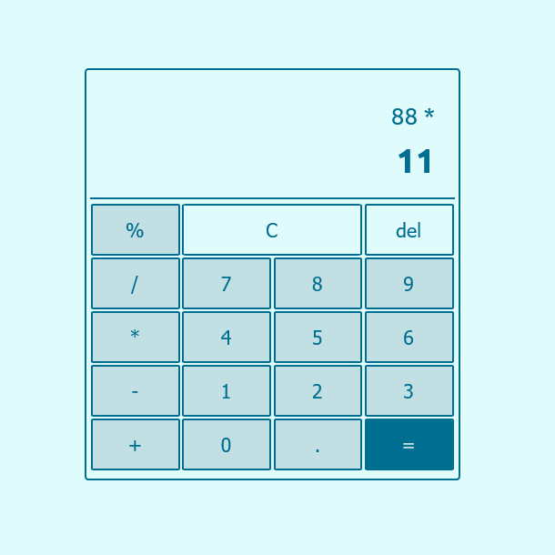

# Responsive Javascript calculator

## How to use
- Click on the delete button to delete the last character in the input
- Click on the clear button to clear the entire input
- Click [here]() for live preview

Author - [Kiruthiga K](https://kiruanime2003.gitlab.io/)